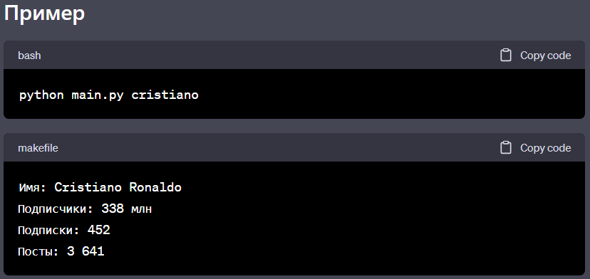

# Instagram_Scrapper

##  Instagram Web Scraper

> Программа командной строки (CLI) для сбора данных с аккаунта Instagram.



**Пример программы так работает.**


## Установка

**Для установки программы, выполните следующие шаги:**

1. Установите Python (версия 3.11.4) на ваш компьютер.

2. Клонируйте репозиторий с GitHub:
    ```bash
    $  git clone git clone https://github.com/Humoyun004/Instagram_Scrapper.git
    ```
3. Перейдите в директорию с программой:
cd Instagram_Scrapper

4. Установите необходимые зависимости, выполнив следующую команду: 
    ```bash
    $ pip install requests beautifulsoup4
    ```
## Использование
1. **Откройте командную строку или терминал.**

2. **Перейдите в каталог, где находится файл main.py.**

3. **Запустите программу, указав имя пользователя Instagram, данные которого вы хотите собрать. Используйте следующую команду:**
    ```bash
    $ python main.py <имя_пользователя>
    ```
    **Замените <имя_пользователя> на фактическое имя пользователя Instagram.**

## Результаты
Программа выведет следующую информацию об аккаунте Instagram:
- **Имя**: Имя пользователя Instagram.
- **Подписчики**: Количество подписчиков пользователя.
- **Подписки**: Количество пользователей, на которых подписан пользователь.
- **Посты**: Количество опубликованных пользователем постов.

## Зависимости
Программа зависит от следующих пакетов Python:
- **requests**: Используется для отправки HTTP-запросов на страницу Instagram.
- **beautifulsoup4**: Используется для парсинга HTML-кода страницы Instagram.

Вы можете установить зависимости, выполнив следующую команду:
```bash
$ pip install requests beautifulsoup4
```
## Вклад
**Если вы хотите внести свой вклад в развитие приложения "Instagram Web Scraper", пожалуйста, следуйте этим шагам:**

1. Форкните репозиторий на GitHub.
2. Клонируйте ваш форк репозитория на локальную машину.
3. Создайте новую ветку для вашей функции или исправления ошибки.
4. Внесите изменения и сделайте коммиты с описательными сообщениями.
5. Отправьте ваши изменения в ваш форк репозитория.
6. Создайте pull request (запрос на включение) в основной репозиторий.


## Контакты
**Если у вас есть вопросы или предложения относительно приложения "Instagram Web Scraper", пожалуйста, свяжитесь с нами по адресу humoyunakbaraliev1@gmail.com. Мы ценим ваше мнение!**


